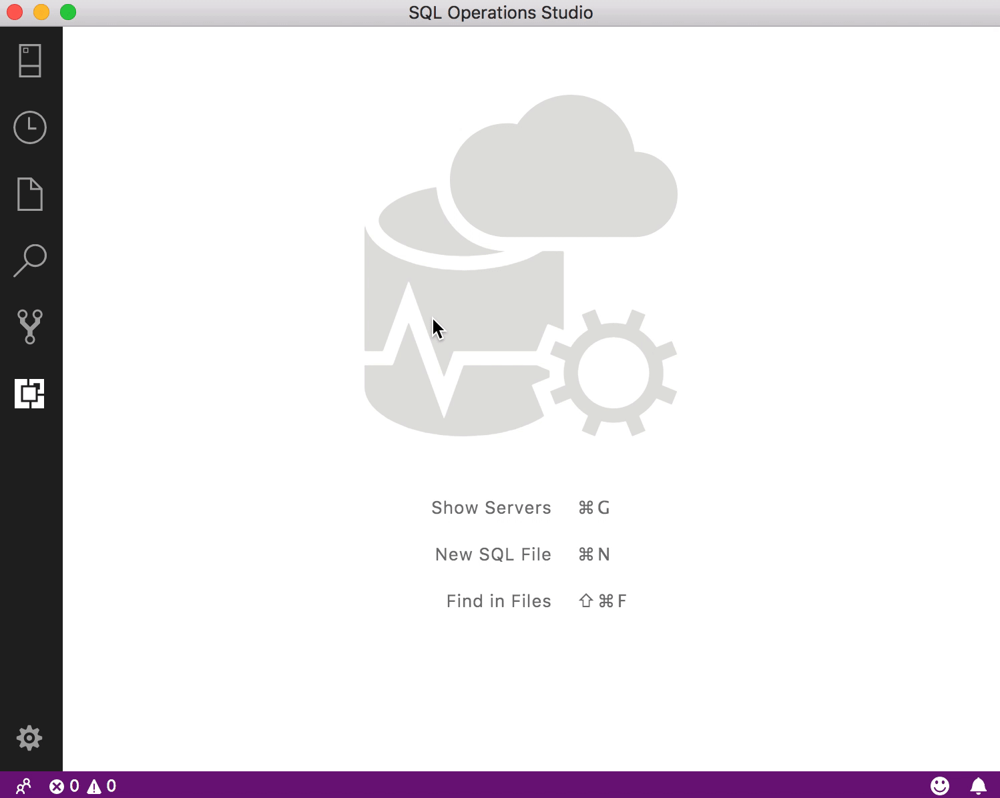

# SQLOps extension skeleton

A SQL Operations Studio extension skeleton based on SQL Search extension

## Prerequisites

* NodeJS
* [.NET Core](https://www.microsoft.com/net/download)

## How to run in SQL Ops Studio

1. `npm install`
1. `npm run package`
    * The `.vsix` will be saved to `artifacts/`
1. In SQL Ops Studio, navigate to _File > Install Extension from VSIX Package_ and select the `.vsix` generated in the previous step
1. Reload sqlops

## Using the extension

The extension exposes its functionality through commands. Open the command palette (`Ctrl`/`Cmd` + `Shift` + `p`) and type "MyExtension" to get started.

